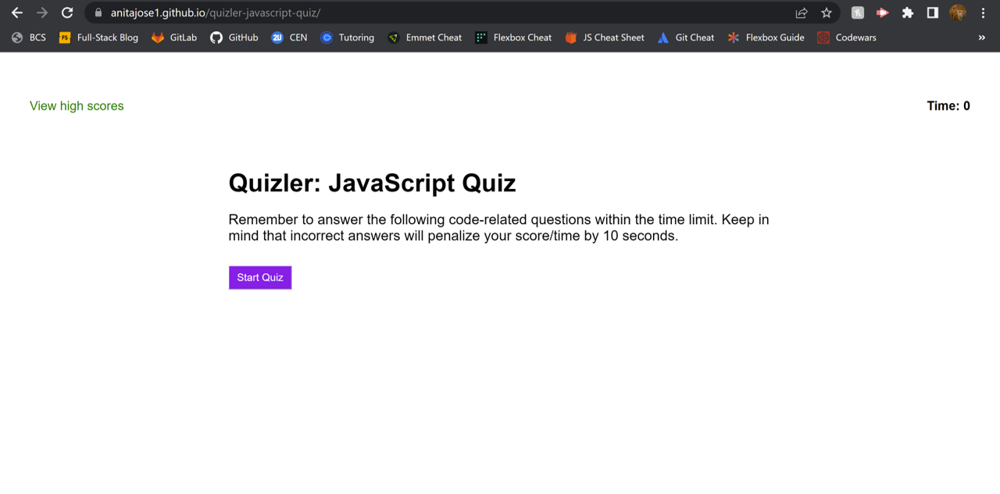

# Quizler: JavaScript Quiz

## Description

Quizler is a timed Javascript quiz application with multiple-choice questions.

The app runs in the browser and features dynamically updated HTML and CSS powered by JavaScript code.

The deployed application can be viewed at: https://anitajose1.github.io/quizler-javascript-quiz/

## Credits

The following sources helped me understand certain JavaScript concepts as I built the app:

- https://developer.mozilla.org/en-US/docs/Web/API/EventTarget/addEventListener
- https://www.w3schools.com/js/js_timing.asp

